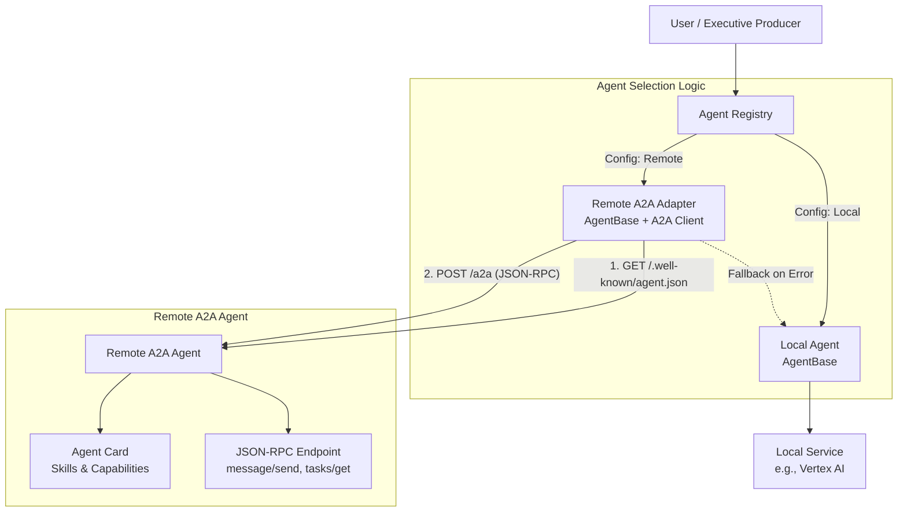
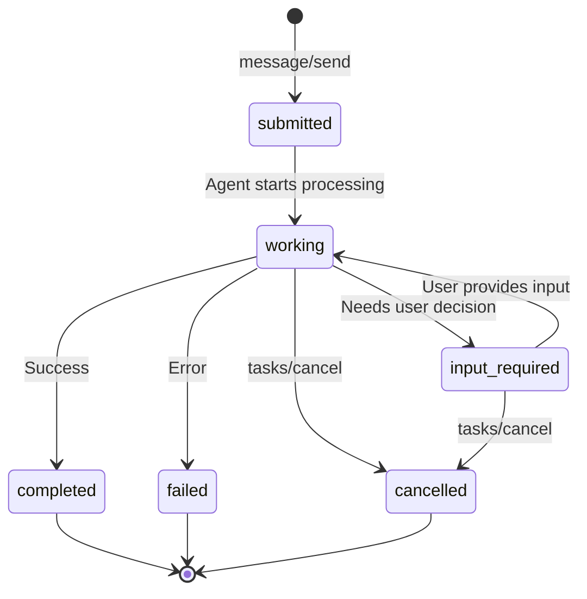

# A2A (Agent-to-Agent) Integration Design Document

## 1. Overview

This design enables the AI Agency to leverage external, specialized "Remote Agents" using the **Google A2A (Agent-to-Agent) Protocol** — an open standard for agent interoperability. The system supports a hybrid architecture where local agents serve as the robust default, while A2A-compliant remote agents can be dynamically discovered and plugged in for superior performance in specific domains (e.g., high-fidelity video generation).

### What is A2A?

The [Agent2Agent (A2A) Protocol](https://a2a-protocol.org/) is an open standard that enables AI agents to:
- **Discover** each other's capabilities via Agent Cards
- **Communicate** using JSON-RPC 2.0 over HTTP(S)
- **Collaborate** on long-running tasks with defined lifecycle states
- **Maintain opacity** — agents interact without exposing internal logic

### Key A2A Concepts

| Concept | Description |
|---------|-------------|
| **Agent Card** | JSON metadata describing agent capabilities, hosted at `/.well-known/agent.json` |
| **JSON-RPC 2.0** | Transport protocol for all A2A communication |
| **Task** | Unit of work with lifecycle states (working, input-required, completed, failed, cancelled) |
| **Message** | Conversational turn containing Parts (text, files, structured data) |
| **Artifact** | Task output (generated assets) with MIME types and parts |
| **Skills** | Declared capabilities that an agent can perform |

## 2. Architecture

The architecture follows a **Router-Adapter** pattern with A2A protocol compliance. The `AgentRegistry` acts as a smart router, deciding whether to use a local agent or an A2A-compliant remote agent based on configuration.



### Key Components

1. **Agent Registry (Router)**: Central authority for dispensing agent instances. Reads configuration from Redis to determine which implementation (Local vs. Remote A2A) to return.

2. **Remote A2A Adapter**: A client-side proxy that:
   - Implements the standard `AgentBase` interface
   - Fetches and caches the remote agent's Agent Card
   - Communicates via A2A JSON-RPC protocol
   - Maps A2A task states to local critique/revise workflow

3. **Local Agent (Default)**: Existing implementation that runs within the current backend.

4. **Agent Card Cache**: Cached metadata from remote agents for capability discovery and LLM tool generation.

## 3. A2A Protocol Specification

Remote agents must be **A2A-compliant**, adhering to the official protocol specification.

### 3.1 Agent Card Discovery

Every A2A agent exposes an **Agent Card** at a well-known URL:

```
GET https://video-agent.example.com/.well-known/agent.json
```

**Agent Card Schema:**
```json
{
  "id": "video_producer_v2",
  "name": "Video Producer Agent",
  "description": "Generates high-fidelity social media videos using advanced AI",
  "protocolVersion": "1.0",
  "url": "https://video-agent.example.com/a2a",
  "provider": {
    "name": "Acme AI Studios",
    "url": "https://acme-ai.example.com"
  },
  "capabilities": {
    "streaming": true,
    "pushNotifications": true
  },
  "skills": [
    {
      "id": "video_generation",
      "name": "Video Generation",
      "description": "Creates 15-second social media videos from text prompts and brand guidelines",
      "inputModes": ["text/plain", "application/json"],
      "outputModes": ["video/mp4", "video/webm"],
      "examples": [
        {
          "input": "Create a 15s video showcasing sneakers with Tokyo neon aesthetic",
          "output": "video/mp4 artifact with neon-lit urban footage"
        }
      ]
    }
  ],
  "securitySchemes": {
    "bearer": {
      "type": "http",
      "scheme": "bearer",
      "description": "API key authentication"
    }
  },
  "security": ["bearer"],
  "defaultInputModes": ["text/plain"],
  "defaultOutputModes": ["application/json"]
}
```

### 3.2 JSON-RPC Transport

All A2A communication uses **JSON-RPC 2.0** over HTTPS:

**Endpoint:** `POST /a2a` (or URL specified in Agent Card)

**Content-Type:** `application/json`

### 3.3 Core Methods

#### message/send — Submit Task to Agent

**Request:**
```json
{
  "jsonrpc": "2.0",
  "id": "req_001",
  "method": "message/send",
  "params": {
    "message": {
      "messageId": "msg_abc123",
      "role": "user",
      "parts": [
        {
          "type": "text",
          "text": "Create a 15-second video for the Aura Smart Sneaker campaign"
        },
        {
          "type": "data",
          "mimeType": "application/json",
          "data": {
            "product_name": "Aura Smart Sneaker",
            "theme": "Tokyo Neon",
            "key_features": ["glowing sole", "adaptive fit"],
            "brand_tone": "bold and innovative"
          }
        }
      ]
    },
    "configuration": {
      "acceptedOutputModes": ["video/mp4"]
    }
  }
}
```

**Response (Task Created):**
```json
{
  "jsonrpc": "2.0",
  "id": "req_001",
  "result": {
    "id": "task_xyz789",
    "contextId": "ctx_campaign_001",
    "status": {
      "state": "working",
      "timestamp": "2025-01-15T10:30:00Z"
    },
    "artifacts": []
  }
}
```

#### tasks/get — Poll Task Status

**Request:**
```json
{
  "jsonrpc": "2.0",
  "id": "req_002",
  "method": "tasks/get",
  "params": {
    "taskId": "task_xyz789"
  }
}
```

**Response (Completed):**
```json
{
  "jsonrpc": "2.0",
  "id": "req_002",
  "result": {
    "id": "task_xyz789",
    "contextId": "ctx_campaign_001",
    "status": {
      "state": "completed",
      "timestamp": "2025-01-15T10:32:00Z"
    },
    "artifacts": [
      {
        "id": "art_video_001",
        "name": "aura_hero_video.mp4",
        "mimeType": "video/mp4",
        "parts": [
          {
            "type": "file",
            "uri": "https://storage.example.com/videos/aura_hero.mp4",
            "mimeType": "video/mp4"
          }
        ],
        "metadata": {
          "duration_seconds": 15,
          "resolution": "1920x1080",
          "theme": "tokyo_neon"
        }
      }
    ]
  }
}
```

#### tasks/cancel — Cancel Running Task

**Request:**
```json
{
  "jsonrpc": "2.0",
  "id": "req_003",
  "method": "tasks/cancel",
  "params": {
    "taskId": "task_xyz789"
  }
}
```

### 3.4 Task States & Lifecycle



| State | Description |
|-------|-------------|
| `submitted` | Task received, not yet started |
| `working` | Agent is actively processing |
| `input-required` | Agent needs user decision (maps to critique workflow) |
| `completed` | Task finished successfully with artifacts |
| `failed` | Task encountered an error |
| `cancelled` | Task was cancelled by user |

### 3.5 Handling Critique via `input-required`

A2A's `input-required` state elegantly maps to our critique/revise workflow:

**Agent Response (Needs Revision):**
```json
{
  "jsonrpc": "2.0",
  "id": "req_002",
  "result": {
    "id": "task_xyz789",
    "status": {
      "state": "input-required",
      "timestamp": "2025-01-15T10:31:30Z",
      "message": {
        "messageId": "msg_critique_001",
        "role": "agent",
        "parts": [
          {
            "type": "text",
            "text": "The 'Tokyo neon' theme is strong, but the video doesn't clearly show the 'glowing sole' feature. Should I add a 2-second close-up of the sole?"
          },
          {
            "type": "data",
            "mimeType": "application/json",
            "data": {
              "critique_type": "feature_visibility",
              "score": 0.7,
              "issues": ["Key feature 'glowing sole' not prominently displayed"],
              "suggested_revision": "Add 2-second close-up of glowing sole"
            }
          }
        ]
      }
    },
    "artifacts": []
  }
}
```

**User Provides Revision Input:**
```json
{
  "jsonrpc": "2.0",
  "id": "req_004",
  "method": "message/send",
  "params": {
    "taskId": "task_xyz789",
    "message": {
      "messageId": "msg_revise_001",
      "role": "user",
      "parts": [
        {
          "type": "text",
          "text": "Yes, add the 2-second close-up of the glowing sole at the end of the video"
        }
      ]
    }
  }
}
```

### 3.6 Message Parts

Messages and Artifacts are composed of **Parts**:

| Part Type | Description | Example |
|-----------|-------------|---------|
| `TextPart` | Plain text content | `{"type": "text", "text": "Create a video..."}` |
| `FilePart` | File reference with URI | `{"type": "file", "uri": "https://...", "mimeType": "video/mp4"}` |
| `DataPart` | Structured JSON data | `{"type": "data", "mimeType": "application/json", "data": {...}}` |

### 3.7 Authentication

A2A supports multiple authentication schemes declared in the Agent Card:

| Scheme | Description |
|--------|-------------|
| `APIKeySecurityScheme` | API key in header or query |
| `HTTPAuthSecurityScheme` | Bearer token or Basic auth |
| `OAuth2SecurityScheme` | OAuth 2.0 flows |
| `MutualTLSSecurityScheme` | Certificate-based auth |

**Example Bearer Auth:**
```
Authorization: Bearer sk_live_abc123...
```

## 4. Configuration Design (Redis-Based)

Configuration is persisted in **Redis** for dynamic updates. Unlike the previous design, we now store **Agent Card URLs** rather than full configurations — the Agent Card is fetched and cached dynamically.

### 4.1 Redis Schema

**Key:** `agency:config:agents`
**Type:** Redis Hash

**Fields:** `agent_id` → JSON configuration

**Example Configuration:**
```json
{
  "video_producer": {
    "provider": "remote",
    "agent_card_url": "https://video-agent.example.com/.well-known/agent.json",
    "api_key_ref": "VIDEO_AGENT_API_KEY",
    "fallback_to_local": true,
    "timeout": {
      "connect": 10,
      "read": 300,
      "total": 600
    },
    "circuit_breaker": {
      "failure_threshold": 5,
      "recovery_timeout_seconds": 60
    }
  }
}
```

**Key Principles:**
- **`agent_card_url`**: URL to fetch the Agent Card (source of truth for capabilities)
- **`api_key_ref`**: Reference to environment variable or secret manager key (NOT the actual secret)
- **`fallback_to_local`**: Whether to fall back to local agent on failure

### 4.2 Agent Card Cache

Agent Cards are cached in Redis with TTL:

**Key:** `agency:cache:agent_cards:{agent_id}`
**Value:** JSON Agent Card
**TTL:** 300 seconds (5 minutes)

```python
async def get_agent_card(self, agent_id: str) -> AgentCard:
    cache_key = f"agency:cache:agent_cards:{agent_id}"

    # Try cache first
    cached = await redis.get(cache_key)
    if cached:
        return AgentCard.model_validate_json(cached)

    # Fetch from remote
    config = await self._get_config(agent_id)
    response = await httpx.get(config.agent_card_url)
    card = AgentCard.model_validate(response.json())

    # Cache with TTL
    await redis.setex(cache_key, 300, card.model_dump_json())
    return card
```

### 4.3 Management API

**Endpoints:**

| Method | Endpoint | Description |
|--------|----------|-------------|
| `GET` | `/admin/agents` | List all agent configurations |
| `GET` | `/admin/agents/{agent_id}/config` | Get agent config |
| `PUT` | `/admin/agents/{agent_id}/config` | Update agent config |
| `DELETE` | `/admin/agents/{agent_id}/config` | Remove agent config |
| `POST` | `/admin/agents/{agent_id}/refresh-card` | Force refresh Agent Card cache |
| `GET` | `/admin/agents/{agent_id}/card` | Get cached Agent Card |

## 5. Adapter Implementation

### 5.1 RemoteA2AAgentAdapter

The adapter inherits from `AgentBase` and uses A2A protocol internally:

```python
from typing import Any, Dict, Optional
import httpx
from app.agents.base import AgentBase
from app.models.assets import CritiqueResult


class RemoteA2AAgentAdapter(AgentBase):
    """
    A2A-compliant adapter that implements AgentBase interface
    while communicating with remote agents via JSON-RPC 2.0.
    """

    def __init__(
        self,
        agent_id: str,
        agent_card_url: str,
        api_key: str,
        timeout: dict = None
    ):
        super().__init__(agent_id)
        self.agent_card_url = agent_card_url
        self._agent_card: Optional[AgentCard] = None
        self._client = httpx.AsyncClient(
            headers={"Authorization": f"Bearer {api_key}"},
            timeout=httpx.Timeout(
                connect=timeout.get("connect", 10),
                read=timeout.get("read", 300),
                pool=timeout.get("total", 600)
            )
        )
        self._request_id = 0

    async def _ensure_agent_card(self) -> AgentCard:
        """Fetch and cache Agent Card."""
        if self._agent_card is None:
            response = await self._client.get(self.agent_card_url)
            response.raise_for_status()
            self._agent_card = AgentCard.model_validate(response.json())
        return self._agent_card

    async def _jsonrpc_call(self, method: str, params: dict) -> dict:
        """Make JSON-RPC 2.0 call to remote agent."""
        card = await self._ensure_agent_card()
        self._request_id += 1

        payload = {
            "jsonrpc": "2.0",
            "id": f"req_{self._request_id}",
            "method": method,
            "params": params
        }

        response = await self._client.post(card.url, json=payload)
        response.raise_for_status()

        result = response.json()
        if "error" in result:
            raise A2AError(result["error"])

        return result.get("result", {})

    async def execute(
        self, task: Dict[str, Any], context: Dict[str, Any]
    ) -> Dict[str, Any]:
        """
        Execute task via A2A message/send.
        Polls until task reaches terminal state.
        """
        # Build A2A message with parts
        message = {
            "messageId": f"msg_{uuid.uuid4()}",
            "role": "user",
            "parts": [
                {"type": "text", "text": task.get("description", "")},
                {"type": "data", "mimeType": "application/json", "data": {
                    "task": task,
                    "context": context
                }}
            ]
        }

        # Send initial message
        result = await self._jsonrpc_call("message/send", {
            "message": message,
            "configuration": {"acceptedOutputModes": task.get("output_modes", ["application/json"])}
        })

        task_id = result["id"]

        # Poll until terminal state
        while result["status"]["state"] in ("submitted", "working"):
            await asyncio.sleep(2)
            result = await self._jsonrpc_call("tasks/get", {"taskId": task_id})

        # Handle terminal states
        if result["status"]["state"] == "completed":
            return {
                "status": "completed",
                "artifacts": result.get("artifacts", []),
                "provider": "remote",
                "agent_id": self.agent_id
            }
        elif result["status"]["state"] == "input-required":
            # Map to critique workflow
            return {
                "status": "needs_revision",
                "task_id": task_id,
                "critique": self._extract_critique(result["status"].get("message", {}))
            }
        elif result["status"]["state"] == "failed":
            raise A2ATaskError(result["status"].get("message", "Task failed"))
        else:
            raise A2ATaskError(f"Unexpected state: {result['status']['state']}")

    async def critique(
        self, result: Dict[str, Any], brief: Dict[str, Any]
    ) -> CritiqueResult:
        """
        For remote A2A agents, critique is handled via input-required state.
        This method extracts critique from the A2A response.
        """
        if result.get("status") == "needs_revision":
            critique_data = result.get("critique", {})
            return CritiqueResult(
                status="REVISE" if critique_data.get("issues") else "PASS",
                score=critique_data.get("score", 0.5),
                issues=critique_data.get("issues", []),
                revision_instructions=critique_data.get("suggested_revision")
            )
        return CritiqueResult(status="PASS", score=1.0, issues=[])

    async def revise(
        self, result: Dict[str, Any], critique: CritiqueResult
    ) -> Dict[str, Any]:
        """
        Continue A2A task with revision instructions.
        """
        task_id = result.get("task_id")
        if not task_id:
            raise ValueError("Cannot revise without task_id from input-required state")

        # Send revision message to existing task
        message = {
            "messageId": f"msg_{uuid.uuid4()}",
            "role": "user",
            "parts": [
                {"type": "text", "text": critique.revision_instructions or "Please revise"},
                {"type": "data", "mimeType": "application/json", "data": {
                    "action": "revise",
                    "critique": critique.model_dump()
                }}
            ]
        }

        result = await self._jsonrpc_call("message/send", {
            "taskId": task_id,
            "message": message
        })

        # Poll until complete
        while result["status"]["state"] in ("submitted", "working"):
            await asyncio.sleep(2)
            result = await self._jsonrpc_call("tasks/get", {"taskId": task_id})

        if result["status"]["state"] == "completed":
            return {
                "status": "completed",
                "artifacts": result.get("artifacts", [])
            }
        else:
            raise A2ATaskError(f"Revision failed: {result['status']['state']}")

    def _extract_critique(self, message: dict) -> dict:
        """Extract critique data from A2A message parts."""
        critique = {"issues": [], "score": 0.5}
        for part in message.get("parts", []):
            if part.get("type") == "data" and "critique" in str(part.get("data", {})):
                critique.update(part["data"])
            elif part.get("type") == "text":
                critique["feedback"] = part["text"]
        return critique

    async def get_skills(self) -> list:
        """Get skills from Agent Card for dynamic tool generation."""
        card = await self._ensure_agent_card()
        return card.skills
```

### 5.2 Updated AgentRegistry

```python
class AgentRegistry:
    """
    Central registry supporting both local and A2A remote agents.
    """

    def __init__(self):
        self._local_agents: Dict[str, AgentBase] = {}
        self._remote_adapters: Dict[str, RemoteA2AAgentAdapter] = {}
        self._initialize_local_agents()

    async def get_agent(self, agent_id: str) -> Optional[AgentBase]:
        """
        Get agent by ID, checking remote config first.
        """
        # Check for remote configuration
        config = await self._load_remote_config(agent_id)

        if config and config.get("provider") == "remote":
            return await self._get_or_create_remote_adapter(agent_id, config)

        # Fall back to local agent
        return self._local_agents.get(agent_id)

    async def _get_or_create_remote_adapter(
        self, agent_id: str, config: dict
    ) -> RemoteA2AAgentAdapter:
        """Create or retrieve cached remote adapter."""
        if agent_id not in self._remote_adapters:
            api_key = os.environ.get(config["api_key_ref"])
            if not api_key:
                raise ConfigurationError(f"Missing API key: {config['api_key_ref']}")

            self._remote_adapters[agent_id] = RemoteA2AAgentAdapter(
                agent_id=agent_id,
                agent_card_url=config["agent_card_url"],
                api_key=api_key,
                timeout=config.get("timeout", {})
            )

        return self._remote_adapters[agent_id]

    async def list_agents_with_skills(self) -> List[AgentInfo]:
        """
        List all agents with their skills for LLM tool generation.
        Combines local agents with remote Agent Card skills.
        """
        agents = []

        # Local agents
        for agent_id, agent in self._local_agents.items():
            agents.append(AgentInfo(
                agent_id=agent_id,
                name=agent.__class__.__name__,
                description=getattr(agent, "description", ""),
                provider="local",
                skills=getattr(agent, "skills", [])
            ))

        # Remote agents from Redis config
        remote_configs = await self._list_remote_configs()
        for agent_id, config in remote_configs.items():
            try:
                adapter = await self._get_or_create_remote_adapter(agent_id, config)
                card = await adapter._ensure_agent_card()
                agents.append(AgentInfo(
                    agent_id=agent_id,
                    name=card.name,
                    description=card.description,
                    provider="remote",
                    skills=[s.model_dump() for s in card.skills]
                ))
            except Exception as e:
                logger.warning(f"Failed to fetch Agent Card for {agent_id}: {e}")

        return agents
```

## 6. Error Handling & Fallback

### 6.1 Error Types

| Error | A2A State | Handling |
|-------|-----------|----------|
| Network timeout | N/A | Retry with backoff, then fallback |
| Agent Card fetch failed | N/A | Use cached card or fallback |
| Task failed | `failed` | Return error to user, optionally fallback |
| Task cancelled | `cancelled` | Acknowledge cancellation |
| Auth failure (401/403) | N/A | Log and fail (no fallback) |

### 6.2 Fallback Strategy

```python
async def execute_with_fallback(
    self, agent_id: str, task: dict, context: dict
) -> dict:
    """Execute with automatic fallback to local agent."""
    config = await self._load_remote_config(agent_id)

    if config and config.get("provider") == "remote":
        try:
            adapter = await self._get_or_create_remote_adapter(agent_id, config)
            return await adapter.execute(task, context)
        except (A2AError, httpx.TimeoutException, httpx.ConnectError) as e:
            logger.warning(f"Remote agent {agent_id} failed: {e}")

            if config.get("fallback_to_local", True):
                logger.info(f"Falling back to local agent: {agent_id}")
                # Record failure for circuit breaker
                await self._record_failure(agent_id)

                local_agent = self._local_agents.get(agent_id)
                if local_agent:
                    return await local_agent.execute(task, context)

            raise

    # Use local agent directly
    return await self._local_agents[agent_id].execute(task, context)
```

### 6.3 Circuit Breaker

```python
class CircuitBreaker:
    """Prevents repeated calls to failing remote agents."""

    def __init__(self, failure_threshold: int = 5, recovery_timeout: int = 60):
        self.failure_threshold = failure_threshold
        self.recovery_timeout = recovery_timeout
        self._failures: Dict[str, int] = {}
        self._open_until: Dict[str, float] = {}

    async def is_open(self, agent_id: str) -> bool:
        """Check if circuit is open (blocking calls)."""
        if agent_id in self._open_until:
            if time.time() < self._open_until[agent_id]:
                return True
            else:
                # Recovery period ended, allow attempt
                del self._open_until[agent_id]
                self._failures[agent_id] = 0
        return False

    async def record_failure(self, agent_id: str):
        """Record a failure and potentially open the circuit."""
        self._failures[agent_id] = self._failures.get(agent_id, 0) + 1
        if self._failures[agent_id] >= self.failure_threshold:
            self._open_until[agent_id] = time.time() + self.recovery_timeout
            logger.warning(f"Circuit opened for {agent_id}")

    async def record_success(self, agent_id: str):
        """Record success and reset failure count."""
        self._failures[agent_id] = 0
```

## 7. Frontend Interaction & UI Design

The frontend provides a complete interface for managing A2A agents dynamically, displaying agent status in real-time, and enabling interaction with agents through the Executive Producer.

### 7.1 UI Architecture Overview

```
┌─────────────────────────────────────────────────────────────────────────────┐
│                              AI Agency Dashboard                              │
├─────────────────────────────────────────────────────────────────────────────┤
│  ┌─────────────────────────────────────────────────────────────────────────┐ │
│  │                        Agent Status Bar                                  │ │
│  │  ┌──────────┐ ┌──────────┐ ┌──────────┐ ┌──────────┐ ┌─────────────────┐│ │
│  │  │ Strategy │ │Art Dir.  │ │ Video    │ │ Audio    │ │ + Add Agent     ││ │
│  │  │ ● Local  │ │ ● Local  │ │ ◐ Remote │ │ ● Local  │ │                 ││ │
│  │  │ Ready    │ │ Working  │ │ Ready    │ │ Ready    │ │                 ││ │
│  │  └──────────┘ └──────────┘ └──────────┘ └──────────┘ └─────────────────┘│ │
│  └─────────────────────────────────────────────────────────────────────────┘ │
│                                                                               │
│  ┌──────────────────────────────────┐  ┌──────────────────────────────────┐  │
│  │     Executive Producer Chat      │  │         Project Brief            │  │
│  │  ┌────────────────────────────┐  │  │  Product: Aura Smart Sneaker     │  │
│  │  │ 🎙️ Voice Interface Active  │  │  │  Theme: Tokyo Neon               │  │
│  │  │                            │  │  │  ...                             │  │
│  │  │ Producer: "I've delegated  │  │  │                                  │  │
│  │  │ video creation to the      │  │  ├──────────────────────────────────┤  │
│  │  │ enhanced Video Producer.   │  │  │      Agent Management Panel      │  │
│  │  │ It's now working..."       │  │  │  [Manage Agents]                 │  │
│  │  │                            │  │  │                                  │  │
│  │  └────────────────────────────┘  │  └──────────────────────────────────┘  │
│  └──────────────────────────────────┘                                        │
└─────────────────────────────────────────────────────────────────────────────┘
```

### 7.2 Agent Status Bar Component

The Agent Status Bar displays all available agents (local and remote) with real-time status updates.

#### 7.2.1 Agent Status Card

```tsx
// components/agents/AgentStatusCard.tsx
interface AgentStatusCardProps {
  agent: AgentInfo;
  onSelect: (agentId: string) => void;
  onRemove?: (agentId: string) => void;
}

interface AgentInfo {
  agent_id: string;
  name: string;
  description: string;
  provider: "local" | "remote";
  status: "ready" | "working" | "error" | "offline";
  current_task?: {
    task_id: string;
    state: "submitted" | "working" | "input-required" | "completed" | "failed";
    progress?: number;
  };
  skills: AgentSkill[];
  agent_card?: AgentCard;  // Full Agent Card for remote agents
}

// Status indicators
const StatusIndicator = {
  ready: "● green",
  working: "◐ yellow (animated)",
  error: "● red",
  offline: "○ gray"
};
```

#### 7.2.2 Agent Status Bar Layout

```tsx
// components/agents/AgentStatusBar.tsx
export function AgentStatusBar() {
  const { agents, isLoading } = useAgents();
  const [showAddModal, setShowAddModal] = useState(false);

  return (
    <div className="agent-status-bar">
      {/* Local Agents */}
      <div className="agent-group">
        <span className="group-label">Local Agents</span>
        {agents.filter(a => a.provider === "local").map(agent => (
          <AgentStatusCard key={agent.agent_id} agent={agent} />
        ))}
      </div>

      {/* Divider */}
      <div className="divider" />

      {/* Remote A2A Agents */}
      <div className="agent-group">
        <span className="group-label">Remote Agents</span>
        {agents.filter(a => a.provider === "remote").map(agent => (
          <AgentStatusCard
            key={agent.agent_id}
            agent={agent}
            onRemove={handleRemoveAgent}
          />
        ))}
      </div>

      {/* Add Agent Button */}
      <button
        className="add-agent-btn"
        onClick={() => setShowAddModal(true)}
      >
        + Add Agent
      </button>

      {/* Add Agent Modal */}
      {showAddModal && (
        <AddAgentModal onClose={() => setShowAddModal(false)} />
      )}
    </div>
  );
}
```

#### 7.2.3 Agent Card Hover Details

When hovering over an agent card, show expanded details:

```tsx
// components/agents/AgentHoverCard.tsx
export function AgentHoverCard({ agent }: { agent: AgentInfo }) {
  return (
    <div className="agent-hover-card">
      <div className="header">
        <h3>{agent.name}</h3>
        {agent.provider === "remote" && (
          <span className="badge remote">A2A Remote</span>
        )}
      </div>

      <p className="description">{agent.description}</p>

      {/* Skills List */}
      <div className="skills">
        <h4>Capabilities</h4>
        {agent.skills.map(skill => (
          <div key={skill.id} className="skill">
            <span className="skill-name">{skill.name}</span>
            <span className="skill-desc">{skill.description}</span>
            <div className="skill-modes">
              <span>Input: {skill.inputModes?.join(", ")}</span>
              <span>Output: {skill.outputModes?.join(", ")}</span>
            </div>
          </div>
        ))}
      </div>

      {/* Current Task Status (if working) */}
      {agent.current_task && (
        <div className="current-task">
          <h4>Current Task</h4>
          <div className="task-state">{agent.current_task.state}</div>
          {agent.current_task.progress && (
            <progress value={agent.current_task.progress} max={100} />
          )}
        </div>
      )}

      {/* Remote Agent: Show Agent Card URL */}
      {agent.provider === "remote" && agent.agent_card && (
        <div className="agent-card-info">
          <span className="url">{agent.agent_card.url}</span>
          <span className="version">v{agent.agent_card.version}</span>
        </div>
      )}
    </div>
  );
}
```

### 7.3 Add Agent Modal

A modal dialog for dynamically adding new A2A remote agents.

```tsx
// components/agents/AddAgentModal.tsx
interface AddAgentForm {
  agent_card_url: string;
  api_key: string;
  agent_id_override?: string;  // Optional custom ID
  fallback_to_local: boolean;
}

export function AddAgentModal({ onClose }: { onClose: () => void }) {
  const [form, setForm] = useState<AddAgentForm>({
    agent_card_url: "",
    api_key: "",
    fallback_to_local: true
  });
  const [agentCard, setAgentCard] = useState<AgentCard | null>(null);
  const [isValidating, setIsValidating] = useState(false);
  const [error, setError] = useState<string | null>(null);

  // Step 1: Validate Agent Card URL
  const handleValidateUrl = async () => {
    setIsValidating(true);
    setError(null);
    try {
      const response = await fetch("/api/agents/validate-card", {
        method: "POST",
        headers: { "Content-Type": "application/json" },
        body: JSON.stringify({ agent_card_url: form.agent_card_url })
      });

      if (!response.ok) throw new Error("Failed to fetch Agent Card");

      const card = await response.json();
      setAgentCard(card);
    } catch (err) {
      setError(err.message);
    } finally {
      setIsValidating(false);
    }
  };

  // Step 2: Register Agent
  const handleRegister = async () => {
    try {
      const response = await fetch("/api/agents", {
        method: "POST",
        headers: { "Content-Type": "application/json" },
        body: JSON.stringify({
          agent_id: form.agent_id_override || agentCard?.id,
          provider: "remote",
          agent_card_url: form.agent_card_url,
          api_key: form.api_key,
          fallback_to_local: form.fallback_to_local
        })
      });

      if (!response.ok) throw new Error("Failed to register agent");

      onClose();
      // Toast: "Agent registered successfully!"
    } catch (err) {
      setError(err.message);
    }
  };

  return (
    <div className="modal-overlay">
      <div className="modal add-agent-modal">
        <h2>Add Remote A2A Agent</h2>

        {/* Step 1: Enter Agent Card URL */}
        <div className="form-section">
          <label>Agent Card URL</label>
          <div className="input-with-button">
            <input
              type="url"
              placeholder="https://agent.example.com/.well-known/agent.json"
              value={form.agent_card_url}
              onChange={e => setForm({ ...form, agent_card_url: e.target.value })}
            />
            <button onClick={handleValidateUrl} disabled={isValidating}>
              {isValidating ? "Validating..." : "Validate"}
            </button>
          </div>
        </div>

        {/* Show Agent Card Preview after validation */}
        {agentCard && (
          <div className="agent-card-preview">
            <h3>Agent Card Preview</h3>
            <div className="card-details">
              <div className="field">
                <label>Name</label>
                <span>{agentCard.name}</span>
              </div>
              <div className="field">
                <label>Description</label>
                <span>{agentCard.description}</span>
              </div>
              <div className="field">
                <label>Provider</label>
                <span>{agentCard.provider?.name}</span>
              </div>
              <div className="field">
                <label>Skills</label>
                <ul>
                  {agentCard.skills.map(skill => (
                    <li key={skill.id}>
                      <strong>{skill.name}</strong>: {skill.description}
                    </li>
                  ))}
                </ul>
              </div>
              <div className="field">
                <label>Capabilities</label>
                <span>
                  {agentCard.capabilities?.streaming && "Streaming "}
                  {agentCard.capabilities?.pushNotifications && "Push Notifications"}
                </span>
              </div>
            </div>
          </div>
        )}

        {/* Step 2: API Key & Options */}
        {agentCard && (
          <>
            <div className="form-section">
              <label>API Key</label>
              <input
                type="password"
                placeholder="Enter API key for authentication"
                value={form.api_key}
                onChange={e => setForm({ ...form, api_key: e.target.value })}
              />
              <span className="help-text">
                Required authentication: {agentCard.security?.join(", ")}
              </span>
            </div>

            <div className="form-section">
              <label>Agent ID (optional)</label>
              <input
                type="text"
                placeholder={agentCard.id}
                value={form.agent_id_override}
                onChange={e => setForm({ ...form, agent_id_override: e.target.value })}
              />
              <span className="help-text">
                Override the default agent ID from the Agent Card
              </span>
            </div>

            <div className="form-section checkbox">
              <input
                type="checkbox"
                id="fallback"
                checked={form.fallback_to_local}
                onChange={e => setForm({ ...form, fallback_to_local: e.target.checked })}
              />
              <label htmlFor="fallback">
                Fall back to local agent if remote is unavailable
              </label>
            </div>
          </>
        )}

        {error && <div className="error-message">{error}</div>}

        <div className="modal-actions">
          <button className="secondary" onClick={onClose}>Cancel</button>
          <button
            className="primary"
            onClick={handleRegister}
            disabled={!agentCard || !form.api_key}
          >
            Add Agent
          </button>
        </div>
      </div>
    </div>
  );
}
```

### 7.4 Agent Management Panel

A dedicated panel for managing all agents (accessible from Project Brief sidebar).

```tsx
// components/agents/AgentManagementPanel.tsx
export function AgentManagementPanel() {
  const { agents, removeAgent, refreshAgent } = useAgents();
  const [selectedAgent, setSelectedAgent] = useState<string | null>(null);

  return (
    <div className="agent-management-panel">
      <h2>Agent Management</h2>

      {/* Agent List */}
      <div className="agent-list">
        {agents.map(agent => (
          <div
            key={agent.agent_id}
            className={`agent-item ${selectedAgent === agent.agent_id ? "selected" : ""}`}
            onClick={() => setSelectedAgent(agent.agent_id)}
          >
            <div className="agent-info">
              <span className={`status-dot ${agent.status}`} />
              <span className="name">{agent.name}</span>
              <span className={`provider-badge ${agent.provider}`}>
                {agent.provider}
              </span>
            </div>
            <div className="agent-actions">
              {agent.provider === "remote" && (
                <>
                  <button
                    className="icon-btn"
                    onClick={() => refreshAgent(agent.agent_id)}
                    title="Refresh Agent Card"
                  >
                    🔄
                  </button>
                  <button
                    className="icon-btn danger"
                    onClick={() => removeAgent(agent.agent_id)}
                    title="Remove Agent"
                  >
                    🗑️
                  </button>
                </>
              )}
            </div>
          </div>
        ))}
      </div>

      {/* Selected Agent Details */}
      {selectedAgent && (
        <AgentDetailsPanel agentId={selectedAgent} />
      )}
    </div>
  );
}

// Agent Details Panel
function AgentDetailsPanel({ agentId }: { agentId: string }) {
  const { agent, taskHistory, isLoading } = useAgentDetails(agentId);

  if (isLoading || !agent) return <div>Loading...</div>;

  return (
    <div className="agent-details">
      <h3>{agent.name}</h3>
      <p>{agent.description}</p>

      {/* Connection Status for Remote Agents */}
      {agent.provider === "remote" && (
        <div className="connection-status">
          <h4>Connection Status</h4>
          <div className="status-row">
            <span>Endpoint:</span>
            <span>{agent.agent_card?.url}</span>
          </div>
          <div className="status-row">
            <span>Last Health Check:</span>
            <span>{agent.last_health_check || "Never"}</span>
          </div>
          <div className="status-row">
            <span>Circuit Breaker:</span>
            <span className={agent.circuit_open ? "open" : "closed"}>
              {agent.circuit_open ? "Open (Fallback Active)" : "Closed"}
            </span>
          </div>
        </div>
      )}

      {/* Skills */}
      <div className="skills-section">
        <h4>Skills</h4>
        {agent.skills.map(skill => (
          <div key={skill.id} className="skill-card">
            <div className="skill-header">
              <span className="skill-name">{skill.name}</span>
              <span className="skill-id">{skill.id}</span>
            </div>
            <p>{skill.description}</p>
            {skill.examples && (
              <div className="examples">
                <strong>Examples:</strong>
                <ul>
                  {skill.examples.map((ex, i) => (
                    <li key={i}>{ex.input} → {ex.output}</li>
                  ))}
                </ul>
              </div>
            )}
          </div>
        ))}
      </div>

      {/* Task History */}
      <div className="task-history">
        <h4>Recent Tasks</h4>
        {taskHistory.map(task => (
          <div key={task.id} className={`task-item ${task.state}`}>
            <span className="task-id">{task.id}</span>
            <span className="task-state">{task.state}</span>
            <span className="task-time">{formatTime(task.timestamp)}</span>
          </div>
        ))}
      </div>
    </div>
  );
}
```

### 7.5 Real-Time Agent Status Updates (WebSocket)

The frontend subscribes to agent status updates via WebSocket.

```tsx
// hooks/useAgents.ts
export function useAgents() {
  const [agents, setAgents] = useState<AgentInfo[]>([]);
  const queryClient = useQueryClient();

  // Initial fetch
  const { data, isLoading } = useQuery({
    queryKey: ["agents"],
    queryFn: () => fetch("/api/agents").then(r => r.json())
  });

  // WebSocket subscription for real-time updates
  useEffect(() => {
    const ws = new WebSocket(`${WS_URL}/agents/status`);

    ws.onmessage = (event) => {
      const update = JSON.parse(event.data);

      switch (update.type) {
        case "agent_added":
          queryClient.invalidateQueries(["agents"]);
          toast.success(`New agent available: ${update.agent.name}`);
          break;

        case "agent_removed":
          queryClient.invalidateQueries(["agents"]);
          toast.info(`Agent removed: ${update.agent_id}`);
          break;

        case "agent_status_changed":
          setAgents(prev => prev.map(a =>
            a.agent_id === update.agent_id
              ? { ...a, status: update.status, current_task: update.current_task }
              : a
          ));
          break;

        case "task_update":
          // Update specific agent's current task
          setAgents(prev => prev.map(a =>
            a.agent_id === update.agent_id
              ? { ...a, current_task: update.task }
              : a
          ));
          break;
      }
    };

    return () => ws.close();
  }, []);

  // Agent management functions
  const addAgent = async (config: AddAgentRequest) => {
    await fetch("/api/agents", {
      method: "POST",
      headers: { "Content-Type": "application/json" },
      body: JSON.stringify(config)
    });
    queryClient.invalidateQueries(["agents"]);
  };

  const removeAgent = async (agentId: string) => {
    await fetch(`/api/agents/${agentId}`, { method: "DELETE" });
    queryClient.invalidateQueries(["agents"]);
  };

  const refreshAgent = async (agentId: string) => {
    await fetch(`/api/agents/${agentId}/refresh-card`, { method: "POST" });
    queryClient.invalidateQueries(["agents"]);
  };

  return {
    agents: data || [],
    isLoading,
    addAgent,
    removeAgent,
    refreshAgent
  };
}
```

### 7.6 Executive Producer Integration

The Executive Producer automatically discovers new agents and can delegate tasks to them.

#### 7.6.1 Dynamic Tool Awareness

When a new agent is added, the Executive Producer's available tools are updated:

```tsx
// components/producer/ExecutiveProducer.tsx
export function ExecutiveProducer() {
  const { agents } = useAgents();
  const { sendMessage, messages, isListening } = useVoiceInterface();

  // Producer is aware of all agents and their skills
  const availableAgents = useMemo(() => {
    return agents.map(a => ({
      id: a.agent_id,
      name: a.name,
      skills: a.skills,
      provider: a.provider,
      status: a.status
    }));
  }, [agents]);

  // Show which agents Producer can delegate to
  return (
    <div className="executive-producer">
      <VoiceInterface
        isListening={isListening}
        onMessage={sendMessage}
      />

      <div className="conversation">
        {messages.map(msg => (
          <MessageBubble key={msg.id} message={msg} />
        ))}
      </div>

      {/* Available Agents Indicator */}
      <div className="available-agents">
        <span>Available Team:</span>
        {availableAgents.map(agent => (
          <span
            key={agent.id}
            className={`agent-chip ${agent.status} ${agent.provider}`}
            title={agent.skills.map(s => s.name).join(", ")}
          >
            {agent.name}
          </span>
        ))}
      </div>
    </div>
  );
}
```

#### 7.6.2 Task Delegation Visualization

When the Producer delegates to an agent, show the flow:

```tsx
// components/producer/TaskDelegation.tsx
interface TaskDelegationProps {
  agentId: string;
  taskDescription: string;
  status: "delegating" | "working" | "input-required" | "completed" | "failed";
}

export function TaskDelegation({ agentId, taskDescription, status }: TaskDelegationProps) {
  const { agent } = useAgent(agentId);

  return (
    <div className={`task-delegation ${status}`}>
      <div className="delegation-header">
        <span className="producer-icon">🎬</span>
        <span className="arrow">→</span>
        <span className={`agent-icon ${agent?.provider}`}>
          {agent?.provider === "remote" ? "🌐" : "💻"}
        </span>
        <span className="agent-name">{agent?.name}</span>
      </div>

      <div className="task-description">{taskDescription}</div>

      <div className="status-indicator">
        {status === "delegating" && <span>Delegating task...</span>}
        {status === "working" && (
          <span className="working">
            <span className="spinner" /> Agent is working...
          </span>
        )}
        {status === "input-required" && (
          <span className="input-required">
            ⚠️ Agent needs your input
          </span>
        )}
        {status === "completed" && <span className="completed">✓ Completed</span>}
        {status === "failed" && <span className="failed">✗ Failed</span>}
      </div>

      {/* Show artifacts when completed */}
      {status === "completed" && (
        <div className="artifacts">
          {/* Render generated artifacts */}
        </div>
      )}
    </div>
  );
}
```

### 7.7 Backend API for Agent Management

The frontend interacts with these backend endpoints:

#### 7.7.1 REST API Endpoints

| Method | Endpoint | Description | Request Body |
|--------|----------|-------------|--------------|
| `GET` | `/api/agents` | List all agents with status | - |
| `POST` | `/api/agents` | Add new remote agent | `AddAgentRequest` |
| `GET` | `/api/agents/{id}` | Get agent details | - |
| `DELETE` | `/api/agents/{id}` | Remove remote agent | - |
| `POST` | `/api/agents/{id}/refresh-card` | Refresh Agent Card cache | - |
| `POST` | `/api/agents/validate-card` | Validate Agent Card URL | `{ agent_card_url }` |
| `GET` | `/api/agents/{id}/tasks` | Get agent task history | - |

#### 7.7.2 WebSocket Events

| Event Type | Direction | Payload |
|------------|-----------|---------|
| `agent_added` | Server → Client | `{ agent: AgentInfo }` |
| `agent_removed` | Server → Client | `{ agent_id: string }` |
| `agent_status_changed` | Server → Client | `{ agent_id, status, current_task }` |
| `task_update` | Server → Client | `{ agent_id, task: TaskStatus }` |

#### 7.7.3 Request/Response Types

```typescript
// types/agents.ts

interface AddAgentRequest {
  agent_card_url: string;
  api_key: string;
  agent_id?: string;  // Override default ID from Agent Card
  fallback_to_local?: boolean;
  timeout?: {
    connect?: number;
    read?: number;
    total?: number;
  };
}

interface AgentInfo {
  agent_id: string;
  name: string;
  description: string;
  provider: "local" | "remote";
  status: "ready" | "working" | "error" | "offline";
  skills: AgentSkill[];
  current_task?: TaskStatus;
  agent_card?: AgentCard;  // Only for remote agents
  circuit_open?: boolean;
  last_health_check?: string;
}

interface AgentSkill {
  id: string;
  name: string;
  description: string;
  inputModes?: string[];
  outputModes?: string[];
  examples?: { input: string; output: string }[];
}

interface TaskStatus {
  task_id: string;
  state: "submitted" | "working" | "input-required" | "completed" | "failed" | "cancelled";
  progress?: number;
  message?: string;
  artifacts?: Artifact[];
  timestamp: string;
}

interface AgentCard {
  id: string;
  name: string;
  description: string;
  url: string;
  version?: string;
  provider?: { name: string; url?: string };
  capabilities?: { streaming?: boolean; pushNotifications?: boolean };
  skills: AgentSkill[];
  security?: string[];
}
```

### 7.8 Asset Response Format

Assets returned from A2A agents follow the Artifact structure:

```json
{
  "id": "art_video_001",
  "type": "video",
  "name": "aura_hero_video.mp4",
  "mimeType": "video/mp4",
  "url": "https://storage.example.com/videos/aura_hero.mp4",
  "metadata": {
    "provider": "remote",
    "agent_id": "video_producer_v2",
    "agent_name": "Video Producer Agent",
    "duration_seconds": 15,
    "resolution": "1920x1080"
  }
}
```

### 7.9 UI State Management (Zustand)

```typescript
// stores/agentStore.ts
import { create } from "zustand";

interface AgentStore {
  agents: AgentInfo[];
  selectedAgentId: string | null;
  isAddModalOpen: boolean;

  // Actions
  setAgents: (agents: AgentInfo[]) => void;
  updateAgentStatus: (agentId: string, status: Partial<AgentInfo>) => void;
  addAgent: (agent: AgentInfo) => void;
  removeAgent: (agentId: string) => void;
  selectAgent: (agentId: string | null) => void;
  openAddModal: () => void;
  closeAddModal: () => void;
}

export const useAgentStore = create<AgentStore>((set) => ({
  agents: [],
  selectedAgentId: null,
  isAddModalOpen: false,

  setAgents: (agents) => set({ agents }),

  updateAgentStatus: (agentId, status) =>
    set((state) => ({
      agents: state.agents.map((a) =>
        a.agent_id === agentId ? { ...a, ...status } : a
      ),
    })),

  addAgent: (agent) =>
    set((state) => ({ agents: [...state.agents, agent] })),

  removeAgent: (agentId) =>
    set((state) => ({
      agents: state.agents.filter((a) => a.agent_id !== agentId),
    })),

  selectAgent: (agentId) => set({ selectedAgentId: agentId }),

  openAddModal: () => set({ isAddModalOpen: true }),
  closeAddModal: () => set({ isAddModalOpen: false }),
}));
```

## 8. Dynamic Agent Discovery

### 8.1 Registration Process

1. **Admin registers remote agent in Redis:**
```bash
HSET agency:config:agents social_media_manager '{
  "provider": "remote",
  "agent_card_url": "https://social-agent.example.com/.well-known/agent.json",
  "api_key_ref": "SOCIAL_AGENT_API_KEY",
  "fallback_to_local": false
}'
```

2. **Publish config change event:**
```bash
PUBLISH agency:events:config_change '{"agent_id": "social_media_manager", "action": "added"}'
```

3. **AgentRegistry receives event and fetches Agent Card:**
```python
async def on_config_change(self, event: dict):
    agent_id = event["agent_id"]
    if event["action"] == "added":
        config = await self._load_remote_config(agent_id)
        adapter = await self._get_or_create_remote_adapter(agent_id, config)
        # Pre-fetch Agent Card
        await adapter._ensure_agent_card()
        logger.info(f"Registered new A2A agent: {agent_id}")
```

### 8.2 Dynamic Tool Generation for LLM

The Executive Producer's tools are generated from Agent Card skills:

```python
async def build_delegation_tools(registry: AgentRegistry) -> List[Tool]:
    """Build LLM tools from all available agents and their skills."""
    tools = []

    agents = await registry.list_agents_with_skills()

    for agent in agents:
        for skill in agent.skills:
            tools.append({
                "name": f"delegate_{agent.agent_id}_{skill['id']}",
                "description": f"[{agent.name}] {skill['description']}",
                "parameters": {
                    "type": "object",
                    "properties": {
                        "task_description": {
                            "type": "string",
                            "description": "Description of the task to perform"
                        },
                        "input_data": {
                            "type": "object",
                            "description": "Additional input data for the task"
                        }
                    },
                    "required": ["task_description"]
                },
                "metadata": {
                    "agent_id": agent.agent_id,
                    "skill_id": skill["id"],
                    "provider": agent.provider,
                    "input_modes": skill.get("inputModes", []),
                    "output_modes": skill.get("outputModes", [])
                }
            })

    return tools
```

**Example Generated Tool:**
```json
{
  "name": "delegate_social_media_manager_post_generation",
  "description": "[Social Media Manager] Creates engaging social media posts with hashtags and optimal timing",
  "parameters": {
    "type": "object",
    "properties": {
      "task_description": {"type": "string"},
      "input_data": {"type": "object"}
    }
  },
  "metadata": {
    "agent_id": "social_media_manager",
    "skill_id": "post_generation",
    "provider": "remote"
  }
}
```

## 9. Leveraging Google ADK A2A Support

The codebase already includes `google.adk.a2a`. Use it to:

### 9.1 Expose Local Agents as A2A Servers

```python
from google.adk.a2a.utils.agent_to_a2a import to_a2a

# Make VideoProducerAgent accessible via A2A
app = to_a2a(
    agent=VideoProducerAgent(),
    host="0.0.0.0",
    port=8001,
    protocol="https"
)

# Run with: uvicorn module:app --host 0.0.0.0 --port 8001
```

### 9.2 Build Agent Cards Automatically

```python
from google.adk.a2a.utils.agent_card_builder import AgentCardBuilder

builder = AgentCardBuilder(
    agent=VideoProducerAgent(),
    rpc_url="https://video.agency.example.com/a2a",
    capabilities=AgentCapabilities(streaming=True, pushNotifications=True)
)
card = await builder.build()
```

## 10. Security Considerations

| Aspect | Implementation |
|--------|----------------|
| **Transport** | All A2A communication over HTTPS (TLS 1.3) |
| **Secrets** | API keys stored as references (`api_key_ref`), resolved from environment/secrets manager |
| **Validation** | Validate Agent Card schema, verify response signatures if available |
| **Auth** | Support Bearer, OAuth2, mTLS as declared in Agent Card `securitySchemes` |
| **Rate Limiting** | Implement client-side rate limiting per remote agent |
| **Audit** | Log all A2A requests with correlation IDs for tracing |

## 11. Migration Path

### From Current Design to A2A

1. **Phase 1**: Implement `RemoteA2AAgentAdapter` alongside existing code
2. **Phase 2**: Update Redis schema to use `agent_card_url` format
3. **Phase 3**: Migrate existing remote integrations to A2A protocol
4. **Phase 4**: Expose local agents as A2A servers for external consumption

## 12. Agent Selection Indication (Frontend-Backend Alignment)

When a remote agent is added or when tasks are delegated, **both frontend and backend must clearly indicate which agent (local or remote) is being used**. This ensures transparency and helps users understand the system's behavior.

### 12.1 Agent Registration Response

When adding a remote agent, the backend returns detailed information about what will be used:

**POST `/api/agents`**

```json
// Request
{
  "agent_card_url": "https://video-agent.example.com/.well-known/agent.json",
  "api_key": "sk_...",
  "fallback_to_local": true
}

// Response
{
  "success": true,
  "agent": {
    "agent_id": "video_producer",
    "name": "Video Producer Agent",
    "provider": "remote",
    "status": "ready",
    "agent_card": {
      "url": "https://video-agent.example.com/a2a",
      "version": "1.0",
      "skills": [...]
    },
    "configuration": {
      "is_active": true,           // ← This agent WILL be used
      "overrides_local": true,     // ← Replaces local agent
      "fallback_to_local": true,   // ← Falls back if remote fails
      "local_agent_available": true // ← Local backup exists
    }
  },
  "message": "Remote agent 'video_producer' registered. It will be used instead of the local Video Producer agent."
}
```

### 12.2 Agent List with Active Indicator

**GET `/api/agents`** returns which agent is currently active for each capability:

```json
{
  "agents": [
    {
      "agent_id": "video_producer",
      "name": "Video Producer Agent (Remote)",
      "provider": "remote",
      "is_active": true,           // ← Currently used for video tasks
      "status": "ready",
      "overrides": "video_producer_local"  // ← What it replaced
    },
    {
      "agent_id": "video_producer_local",
      "name": "Video Producer",
      "provider": "local",
      "is_active": false,          // ← NOT used (overridden by remote)
      "status": "standby",         // ← Ready as fallback
      "overridden_by": "video_producer"
    },
    {
      "agent_id": "strategy",
      "name": "Strategy Agent",
      "provider": "local",
      "is_active": true,           // ← No remote, local is used
      "status": "ready"
    }
  ]
}
```

### 12.3 Frontend UI: Clear Visual Indication

#### Agent Status Bar with Active Indicators

```tsx
// components/agents/AgentStatusCard.tsx
export function AgentStatusCard({ agent }: { agent: AgentInfo }) {
  return (
    <div className={`agent-card ${agent.provider} ${agent.is_active ? 'active' : 'inactive'}`}>
      {/* Active Badge */}
      {agent.is_active && (
        <div className="active-badge" title="This agent will handle requests">
          ✓ ACTIVE
        </div>
      )}

      {/* Overridden Indicator */}
      {!agent.is_active && agent.overridden_by && (
        <div className="overridden-badge" title={`Overridden by ${agent.overridden_by}`}>
          STANDBY
        </div>
      )}

      {/* Provider Badge */}
      <div className={`provider-badge ${agent.provider}`}>
        {agent.provider === 'remote' ? '🌐 Remote' : '💻 Local'}
      </div>

      <h3>{agent.name}</h3>
      <span className={`status ${agent.status}`}>{agent.status}</span>
    </div>
  );
}
```

#### Add Agent Confirmation Dialog

When adding a remote agent that will override a local one:

```tsx
// components/agents/AddAgentConfirmation.tsx
export function AddAgentConfirmation({
  remoteAgent,
  localAgent,
  onConfirm,
  onCancel
}: Props) {
  return (
    <div className="confirmation-dialog">
      <h3>⚠️ Agent Override Confirmation</h3>

      <div className="override-visualization">
        <div className="agent-box local">
          <span className="label">Currently Active</span>
          <span className="name">{localAgent.name}</span>
          <span className="provider">Local</span>
        </div>

        <div className="arrow">→</div>

        <div className="agent-box remote">
          <span className="label">Will Become Active</span>
          <span className="name">{remoteAgent.name}</span>
          <span className="provider">Remote (A2A)</span>
        </div>
      </div>

      <div className="info-box">
        <p>
          <strong>What this means:</strong>
        </p>
        <ul>
          <li>✓ All video generation tasks will use the remote agent</li>
          <li>✓ Local agent will remain as fallback (if enabled)</li>
          <li>✓ You can switch back at any time</li>
        </ul>
      </div>

      <div className="actions">
        <button onClick={onCancel}>Cancel</button>
        <button onClick={onConfirm} className="primary">
          Confirm: Use Remote Agent
        </button>
      </div>
    </div>
  );
}
```

### 12.4 Task Execution: Show Which Agent Handled It

Every task response includes the actual agent used:

```json
{
  "task_id": "task_xyz789",
  "status": "completed",
  "executed_by": {
    "agent_id": "video_producer",
    "agent_name": "Video Producer Agent",
    "provider": "remote",              // ← Clear indication
    "agent_card_url": "https://video-agent.example.com/.well-known/agent.json",
    "was_fallback": false              // ← Confirms remote was used
  },
  "artifacts": [...]
}

// If fallback occurred:
{
  "task_id": "task_abc123",
  "status": "completed",
  "executed_by": {
    "agent_id": "video_producer_local",
    "agent_name": "Video Producer",
    "provider": "local",
    "was_fallback": true,              // ← Indicates fallback happened
    "fallback_reason": "Remote agent timeout after 30s"
  },
  "artifacts": [...]
}
```

### 12.5 Frontend: Task Result with Agent Attribution

```tsx
// components/tasks/TaskResult.tsx
export function TaskResult({ task }: { task: TaskResponse }) {
  const { executed_by } = task;

  return (
    <div className="task-result">
      {/* Agent Attribution Header */}
      <div className={`executed-by ${executed_by.provider}`}>
        <span className="icon">
          {executed_by.provider === 'remote' ? '🌐' : '💻'}
        </span>
        <span className="text">
          Completed by <strong>{executed_by.agent_name}</strong>
          {executed_by.provider === 'remote' && ' (Remote A2A)'}
        </span>

        {/* Fallback Warning */}
        {executed_by.was_fallback && (
          <div className="fallback-notice">
            ⚠️ Used fallback: {executed_by.fallback_reason}
          </div>
        )}
      </div>

      {/* Artifacts */}
      <div className="artifacts">
        {task.artifacts.map(artifact => (
          <ArtifactCard key={artifact.id} artifact={artifact} />
        ))}
      </div>
    </div>
  );
}
```

### 12.6 Executive Producer: Announce Agent Selection

The Executive Producer verbally announces which agent it's delegating to:

```python
# Backend: Producer generates context-aware delegation message
async def delegate_task(self, agent_id: str, task: dict) -> str:
    agent = await self.registry.get_agent(agent_id)
    agent_info = await self.registry.get_agent_info(agent_id)

    # Generate announcement based on agent type
    if agent_info.provider == "remote":
        announcement = (
            f"I'm delegating this to our enhanced {agent_info.name}, "
            f"which is a remote A2A agent with specialized capabilities. "
            f"This may produce higher quality results."
        )
    else:
        announcement = (
            f"I'm delegating this to our {agent_info.name}. "
            f"Working on it now..."
        )

    # If there was an override situation
    if agent_info.overrides:
        announcement += (
            f" Note: This remote agent is currently set as the primary "
            f"for video tasks, replacing the local agent."
        )

    return announcement
```

### 12.7 WebSocket Events: Real-Time Agent Selection Updates

```typescript
// Frontend WebSocket handler
ws.onmessage = (event) => {
  const update = JSON.parse(event.data);

  switch (update.type) {
    case "agent_activated":
      // A remote agent was added and is now active
      toast.info(
        `${update.agent.name} is now ACTIVE. ` +
        `It will handle ${update.capability} tasks.`
      );
      break;

    case "agent_deactivated":
      // Agent was removed or disabled
      toast.info(
        `${update.agent.name} deactivated. ` +
        `${update.fallback_agent.name} will now handle tasks.`
      );
      break;

    case "agent_fallback_triggered":
      // Real-time fallback notification
      toast.warning(
        `Remote agent unavailable. ` +
        `Falling back to ${update.fallback_agent.name}.`
      );
      break;

    case "task_delegated":
      // Show which agent is handling the task
      toast.info(
        `Task delegated to ${update.agent.name} ` +
        `(${update.agent.provider})`
      );
      break;
  }
};
```

### 12.8 Summary: Frontend-Backend Alignment Checklist

| Scenario | Backend Response | Frontend Display |
|----------|------------------|------------------|
| **Add remote agent** | `overrides_local: true, is_active: true` | Confirmation dialog + "ACTIVE" badge |
| **List agents** | Each agent has `is_active` flag | Active/Standby visual states |
| **Execute task** | `executed_by.provider` in response | Agent attribution in results |
| **Fallback occurs** | `was_fallback: true, fallback_reason` | Warning banner with reason |
| **Remove remote agent** | Event: `agent_deactivated` | Toast + local agent becomes active |
| **Producer delegates** | Announcement message | Voice/text with agent name + type |

---

## Appendix A: Local Agent vs Remote A2A Agent Relationship

### A.1 The Core Relationship: Same Interface, Different Implementation

```
                        ┌─────────────────────────────┐
                        │       AgentBase (ABC)       │
                        │  ─────────────────────────  │
                        │  + execute(task, context)   │
                        │  + critique(result, brief)  │
                        │  + revise(result, critique) │
                        └──────────────┬──────────────┘
                                       │
                                       │ inherits
                        ┌──────────────┴──────────────┐
                        │                             │
                        ▼                             ▼
         ┌──────────────────────────┐   ┌──────────────────────────┐
         │   Local Agent            │   │  RemoteA2AAgentAdapter   │
         │   (e.g., VideoProducer)  │   │                          │
         ├──────────────────────────┤   ├──────────────────────────┤
         │  Runs IN your backend    │   │  Proxy to EXTERNAL agent │
         │  Calls Vertex AI directly│   │  Calls via A2A protocol  │
         │  Fast, no network hops   │   │  Network latency         │
         │  Your code, your control │   │  Third-party service     │
         └──────────────────────────┘   └──────────────────────────┘
```

### A.2 Three Possible Relationships

#### Relationship 1: Same Capability, Different Provider (Most Common)

The remote agent does the **same job** as the local agent, but potentially better.

```
┌─────────────────────────────────────────────────────────────────┐
│                     video_producer                               │
├─────────────────────────────────────────────────────────────────┤
│                                                                  │
│   LOCAL: VideoProducerAgent          REMOTE: A2A Video Agent    │
│   ┌────────────────────────┐         ┌────────────────────────┐ │
│   │ • Uses Vertex AI Veo   │   OR    │ • Uses RunwayML API    │ │
│   │ • 720p output          │         │ • 4K output            │ │
│   │ • Basic effects        │         │ • Advanced effects     │ │
│   │ • Free (your quota)    │         │ • Paid per video       │ │
│   └────────────────────────┘         └────────────────────────┘ │
│                                                                  │
│   FALLBACK: If remote fails → use local (degraded but works)    │
└─────────────────────────────────────────────────────────────────┘
```

**Use case:** You have a basic local implementation, but want to upgrade to a better remote service when available.

#### Relationship 2: Remote Only, No Local Equivalent

The remote agent provides capabilities that **don't exist locally**.

```
┌─────────────────────────────────────────────────────────────────┐
│                   social_media_manager                           │
├─────────────────────────────────────────────────────────────────┤
│                                                                  │
│   LOCAL: (none)                      REMOTE: A2A Social Agent   │
│   ┌────────────────────────┐         ┌────────────────────────┐ │
│   │                        │         │ • Generates posts      │ │
│   │      ❌ Not available  │         │ • Schedules to Twitter │ │
│   │                        │         │ • Analyzes engagement  │ │
│   │                        │         │ • A/B testing          │ │
│   └────────────────────────┘         └────────────────────────┘ │
│                                                                  │
│   FALLBACK: Disabled (fallback_to_local: false)                 │
│   If remote fails → return error to user                        │
└─────────────────────────────────────────────────────────────────┘
```

**Use case:** You dynamically add new capabilities via A2A without writing local code.

#### Relationship 3: Local Only, No Remote

Traditional setup — agent runs entirely in your backend.

```
┌─────────────────────────────────────────────────────────────────┐
│                      strategy                                    │
├─────────────────────────────────────────────────────────────────┤
│                                                                  │
│   LOCAL: StrategyAgent               REMOTE: (none)             │
│   ┌────────────────────────┐         ┌────────────────────────┐ │
│   │ • Generates personas   │         │                        │ │
│   │ • Creates slogans      │         │    ❌ Not configured   │ │
│   │ • Uses Gemini Pro      │         │                        │ │
│   └────────────────────────┘         └────────────────────────┘ │
│                                                                  │
│   No Redis config for this agent → always uses local            │
└─────────────────────────────────────────────────────────────────┘
```

**Use case:** You're happy with local implementation, no need for external service.

### A.3 How AgentRegistry Decides

```python
class AgentRegistry:
    def __init__(self):
        # Local agents are always available (hardcoded)
        self._local_agents = {
            "strategy": StrategyAgent(),
            "art_director": ArtDirectorAgent(),
            "video_producer": VideoProducerAgent(),  # ← Local exists
            "audio_team": AudioTeamAgent(),
            "web_dev": WebDevAgent(),
        }

    async def get_agent(self, agent_id: str) -> AgentBase:
        # Step 1: Check Redis for remote config
        config = await self._load_remote_config(agent_id)

        if config and config.get("provider") == "remote":
            # Step 2: Remote configured → return A2A adapter
            return await self._get_or_create_remote_adapter(agent_id, config)

        # Step 3: No remote config → return local agent
        return self._local_agents.get(agent_id)
```

**Decision Flow:**

```
get_agent("video_producer")
         │
         ▼
┌─────────────────────────────────┐
│ Check Redis for video_producer  │
└─────────────────┬───────────────┘
                  │
     ┌────────────┴────────────┐
     │                         │
     ▼                         ▼
┌─────────────┐         ┌─────────────────┐
│ Config found │         │ No config found │
│ provider:    │         │                 │
│ "remote"     │         │                 │
└──────┬──────┘         └────────┬────────┘
       │                         │
       ▼                         ▼
┌──────────────────┐    ┌──────────────────┐
│ Return           │    │ Return           │
│ RemoteA2AAdapter │    │ LocalAgent       │
│ (talks to A2A)   │    │ (runs locally)   │
└──────────────────┘    └──────────────────┘
```

### A.4 The Key Insight: Polymorphism

Both agents implement `AgentBase`, so the **calling code doesn't care** which one it gets:

```python
# The Executive Producer doesn't know or care if it's local or remote
agent = await registry.get_agent("video_producer")

# Same method call works for both!
result = await agent.execute(
    task={"description": "Create 15s video", "theme": "Tokyo Neon"},
    context={"product": "Aura Smart Sneaker"}
)

# Same critique interface
critique = await agent.critique(result, project_brief)

# Same revision interface
if critique.status == "REVISE":
    result = await agent.revise(result, critique)
```

### A.5 Comparison Table

| Aspect | Local Agent | Remote A2A Agent |
|--------|-------------|------------------|
| **Where it runs** | In your backend | External server |
| **Interface** | `AgentBase` | `AgentBase` (via adapter) |
| **Protocol** | Direct Python calls | JSON-RPC 2.0 over HTTPS |
| **Latency** | Low (in-process) | Higher (network) |
| **Discovery** | Hardcoded in registry | Agent Card at `/.well-known/agent.json` |
| **Skills** | Defined in code | Declared in Agent Card |
| **Control** | Full (your code) | Limited (third-party) |
| **Cost** | Your compute | Their pricing |
| **Availability** | Always (if backend up) | Depends on remote |
| **Updates** | Requires deployment | Transparent (their updates) |

### A.6 Real-World Analogy

Think of it like **hiring for your creative agency**:

| | Local Agent | Remote A2A Agent |
|--|-------------|------------------|
| **Analogy** | In-house employee | Freelancer/contractor |
| **Availability** | Always in office | Available when online |
| **Skill set** | What you trained them | What they advertise (Agent Card) |
| **Communication** | Direct conversation | Email/Slack (A2A protocol) |
| **Fallback** | N/A | "If freelancer unavailable, use in-house" |
| **Cost** | Salary (fixed) | Per-project (variable) |

### A.7 Summary Diagram

```
┌─────────────────────────────────────────────────────────────────┐
│                        AgentBase                                 │
│                    (Abstract Interface)                          │
│                                                                  │
│   "I don't care HOW you do the work, just that you CAN do it"  │
└─────────────────────────────────────────────────────────────────┘
                              │
              ┌───────────────┴───────────────┐
              │                               │
              ▼                               ▼
┌─────────────────────────┐     ┌─────────────────────────────────┐
│      Local Agent        │     │    Remote A2A Agent Adapter     │
├─────────────────────────┤     ├─────────────────────────────────┤
│ • Your code             │     │ • Proxy to external service     │
│ • Your infrastructure   │     │ • Discovered via Agent Card     │
│ • Direct API calls      │     │ • Communicates via JSON-RPC     │
│ • Always available      │     │ • May be higher quality         │
│ • Baseline capability   │     │ • May have unique capabilities  │
└─────────────────────────┘     └─────────────────────────────────┘
              │                               │
              └───────────────┬───────────────┘
                              │
                              ▼
                   ┌─────────────────────┐
                   │   AgentRegistry     │
                   │   decides which     │
                   │   one to use        │
                   └─────────────────────┘
```

**The relationship is:**
1. **Same contract** (interface) — both implement `AgentBase`
2. **Different implementation** — local runs in-process, remote calls external A2A service
3. **Interchangeable** — registry can swap them transparently
4. **Complementary** — local provides fallback, remote provides enhanced capabilities

---

## References

- [A2A Protocol Specification](https://a2a-protocol.org/latest/specification/)
- [Google ADK A2A Documentation](https://google.github.io/adk-docs/a2a/)
- [A2A GitHub Repository](https://github.com/google/A2A)
- [A2A Python SDK](https://pypi.org/project/a2a-sdk/)
