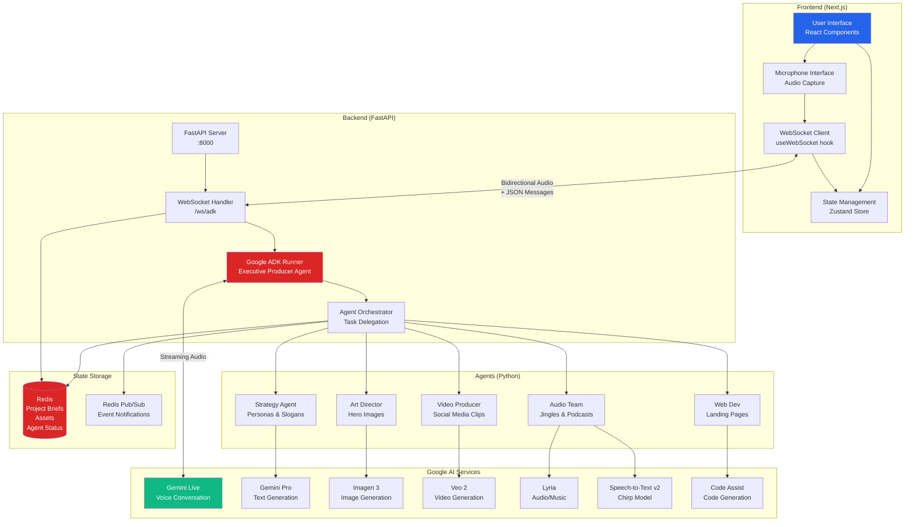
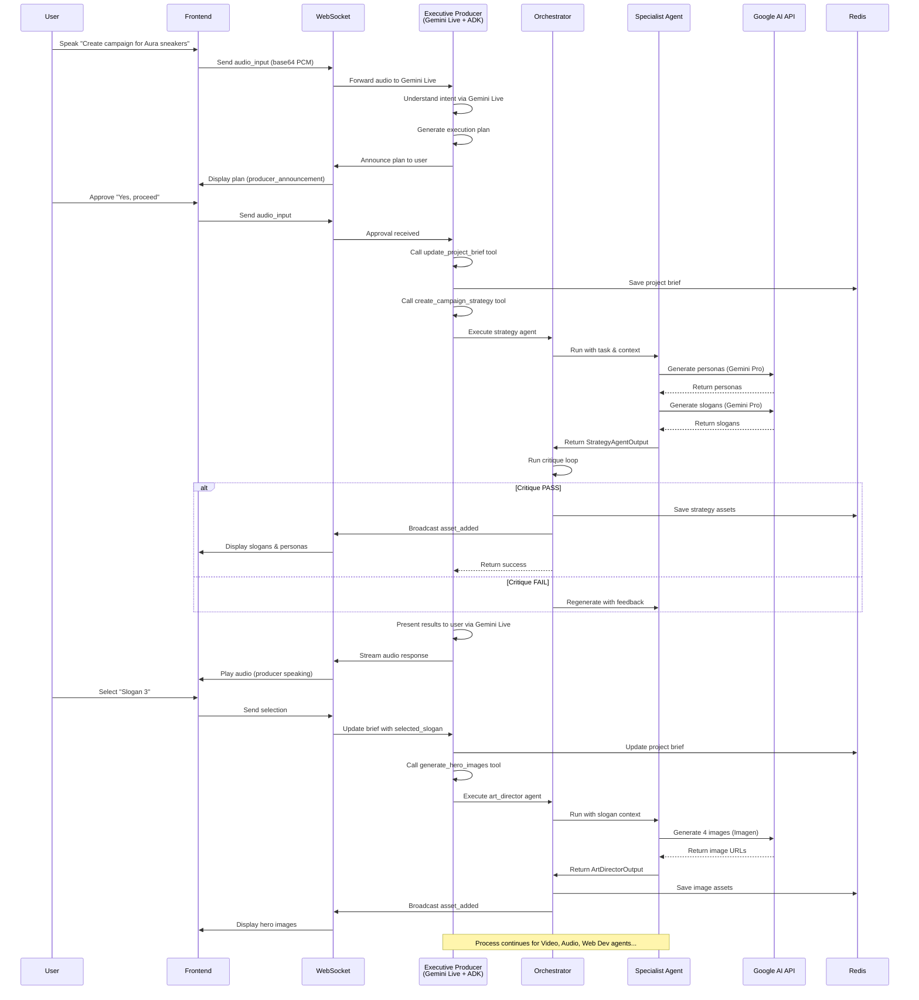
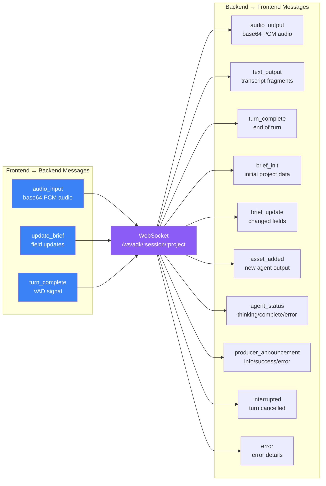
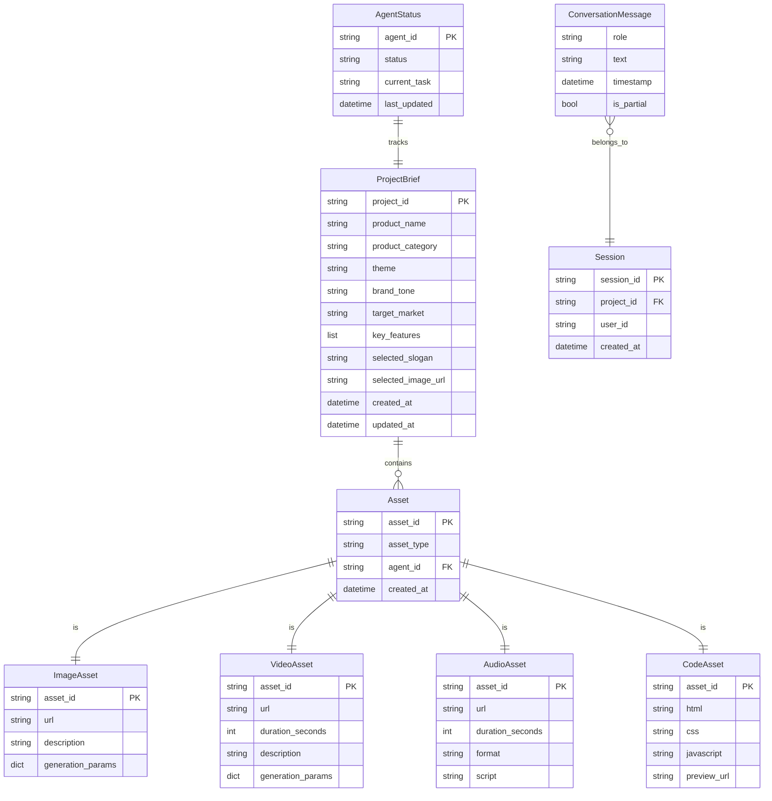
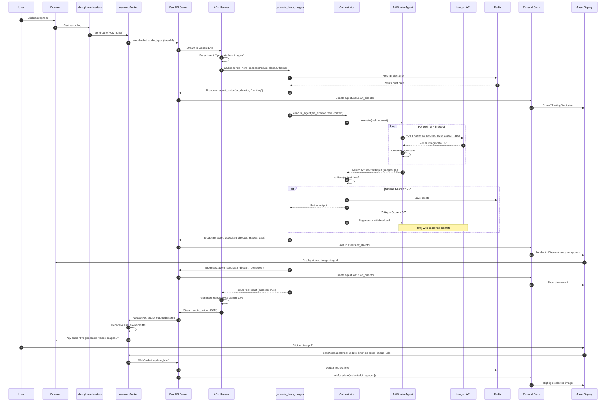
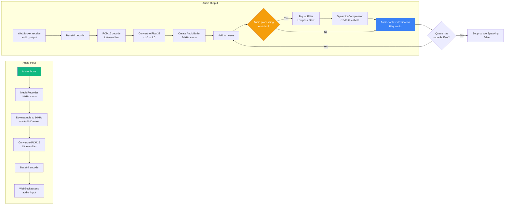
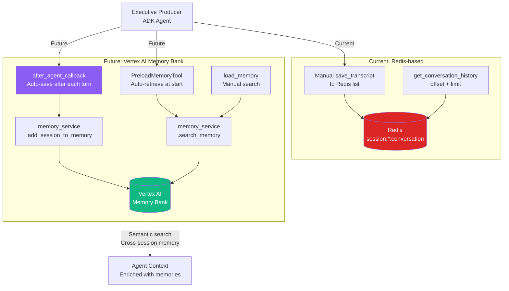
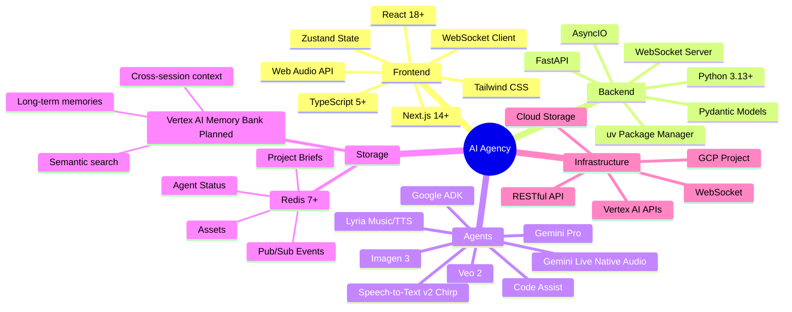
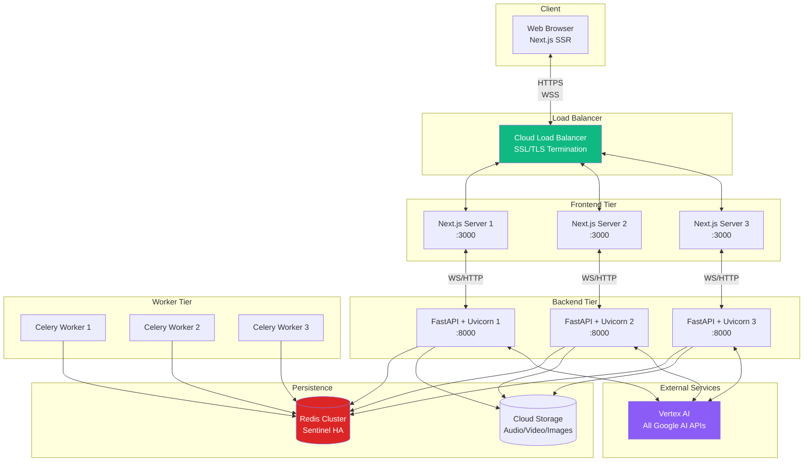

# AI Agency Architecture Diagrams

This document provides comprehensive Mermaid diagrams visualizing the AI Agency system architecture, data flow, and component relationships.

**Generated:** 2025-01-04
**Repository:** AI Agency - Multi-Agent Creative Campaign System

---

## 1. System Architecture Overview



---

## 2. Agent Workflow & Communication Flow



---

## 3. WebSocket Communication Protocol



---

## 4. Data Models & Redis Schema



**Redis Key Structure:**
```
project:{project_id}:brief             → ProjectBrief JSON
project:{project_id}:assets            → List[asset_id]
asset:{asset_id}                       → Asset JSON
agent:{agent_id}:status                → AgentStatus JSON
session:{session_id}                   → Session metadata
session:{session_id}:conversation      → List[ConversationMessage]
pubsub:agent_events                    → Pub/Sub channel
```

---

## 5. Frontend Component Hierarchy

```mermaid
graph TD
    APP[app/page.tsx<br/>Main Application]

    APP --> WORKSPACE[WorkspaceClient<br/>Client-side container]

    WORKSPACE --> LEFT[Left Panel]
    WORKSPACE --> CENTER[Center Panel]
    WORKSPACE --> RIGHT[Right Panel]

    LEFT --> BRIEF[ProjectBriefPanel<br/>Brief display & updates]

    CENTER --> STATUS[AgentStatusBar<br/>5 agent status indicators]
    CENTER --> ASSETS[AssetDisplay<br/>Generated content]
    CENTER --> MIC[MicrophoneInterface<br/>Audio controls]
    CENTER --> ANNOUNCEMENTS[ProducerAnnouncements<br/>Toast notifications]

    ASSETS --> STRATEGY_VIEW[StrategyAssets<br/>Personas & Slogans]
    ASSETS --> ART_VIEW[ArtDirectorAssets<br/>Hero Images]
    ASSETS --> VIDEO_VIEW[VideoProducerAssets<br/>Social Videos]
    ASSETS --> AUDIO_VIEW[AudioTeamAssets<br/>Jingles & Podcasts]
    ASSETS --> WEB_VIEW[WebDevAssets<br/>Landing Page iframe]

    RIGHT --> TRANSCRIPT[TranscriptDisplay<br/>Conversation history<br/>Collapsible]

    WORKSPACE --> HOOKS[Custom Hooks]
    HOOKS --> WS_HOOK[useWebSocket<br/>Bidirectional communication]
    HOOKS --> MIC_HOOK[useMicrophone<br/>Audio capture]

    WORKSPACE --> STORE_CONN[Zustand Store Connection]
    STORE_CONN --> STORE[useProjectStore<br/>Global state]

    STORE --> STATE_BRIEF[brief: ProjectBrief]
    STORE --> STATE_ASSETS[assets: Record<agent, Asset[]>]
    STORE --> STATE_AGENT[agentStatus: Record<agent, Status>]
    STORE --> STATE_TRANSCRIPT[transcript: Message[]]
    STORE --> STATE_ANNOUNCE[announcements: Announcement[]]
    STORE --> STATE_CONN[connected: boolean]
    STORE --> STATE_SPEAKING[producerSpeaking: boolean]

    style APP fill:#2563eb,color:#fff
    style WORKSPACE fill:#7c3aed,color:#fff
    style STORE fill:#dc2626,color:#fff
```

---

## 6. End-to-End Request Flow (Example: Generate Hero Images)



---

## 7. Agent Execution Pipeline

```mermaid
graph TB
    START[Producer calls tool<br/>e.g. generate_hero_images] --> FETCH[Fetch Project Brief<br/>from Redis]

    FETCH --> STATUS1[Broadcast agent_status<br/>thinking]

    STATUS1 --> ORCHESTRATE[Orchestrator.execute_agent<br/>agent_id, task, context]

    ORCHESTRATE --> AGENT_INIT[Agent.execute<br/>with_critique=True]

    AGENT_INIT --> GENERATE[Agent-specific generation<br/>Strategy: Gemini Pro<br/>Art: Imagen<br/>Video: Veo<br/>Audio: Lyria<br/>Web: Code Assist]

    GENERATE --> OUTPUT[Create typed output<br/>StrategyAgentOutput<br/>ArtDirectorOutput<br/>etc.]

    OUTPUT --> CRITIQUE{Critique Loop<br/>Score >= 0.7?}

    CRITIQUE -->|FAIL| FEEDBACK[Generate feedback<br/>via Gemini Pro]
    FEEDBACK --> RETRY{Retry count<br/>< 3?}
    RETRY -->|Yes| GENERATE
    RETRY -->|No| FAIL[Return with issues]

    CRITIQUE -->|PASS| SAVE[Save to Redis<br/>asset:{asset_id}<br/>project:{id}:assets]

    SAVE --> BROADCAST[Broadcast asset_added<br/>via WebSocket]

    BROADCAST --> STATUS2[Broadcast agent_status<br/>complete]

    STATUS2 --> RETURN[Return to Producer<br/>Tool result]

    RETURN --> PRESENT[Producer presents<br/>via Gemini Live]

    FAIL --> STATUS_ERR[Broadcast agent_status<br/>error]
    STATUS_ERR --> RETURN

    style START fill:#2563eb,color:#fff
    style CRITIQUE fill:#dc2626,color:#fff
    style BROADCAST fill:#10b981,color:#fff
    style PRESENT fill:#8b5cf6,color:#fff
```

---

## 8. Audio Processing Pipeline (Frontend)



---

## 9. Memory Bank Migration (Planned)



---

## 10. Technology Stack



---

## Key Architectural Principles

### 1. **Agentic Architecture**
- Executive Producer (Gemini Live) as orchestrator
- 5 specialist agents with distinct responsibilities
- Tool-based function calling for agent coordination

### 2. **Event-Driven Communication**
- WebSocket for real-time bidirectional streaming
- Redis Pub/Sub for agent event notifications
- Async/await throughout the stack

### 3. **Critique Loop**
- Producer evaluates agent outputs against brief
- Automatic regeneration if quality score < 0.7
- Max 3 retries with feedback

### 4. **Audio-First Interface**
- Streaming PCM audio (16kHz input, 24kHz output)
- Gapless playback via scheduled AudioBuffers
- Voice Activity Detection (VAD) for turn management

### 5. **Type Safety**
- Pydantic models for all data structures
- TypeScript throughout frontend
- Validated WebSocket messages

### 6. **Product-Agnostic Design**
- Supports ANY product category (not just sneakers)
- Dynamic prompts based on product_category, brand_tone, theme
- Extensible agent system

---

## Deployment Architecture (Production)



---

**Document Version:** 1.0
**Last Updated:** 2025-01-04
**Total Diagrams:** 10
**Coverage:** Frontend + Backend + Agents + Infrastructure
